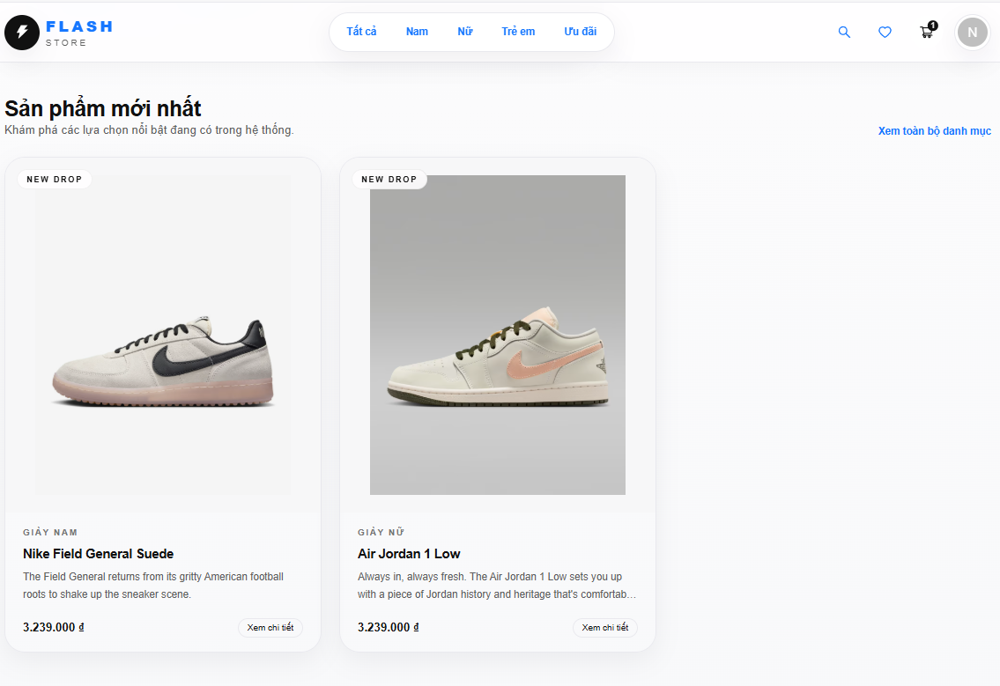
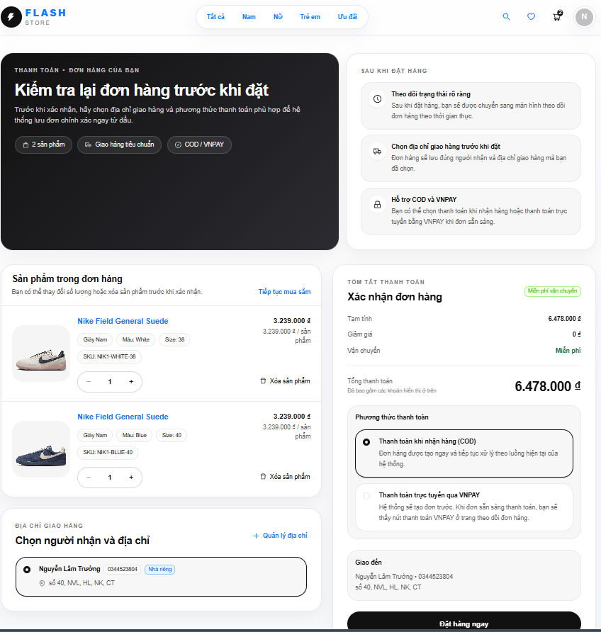
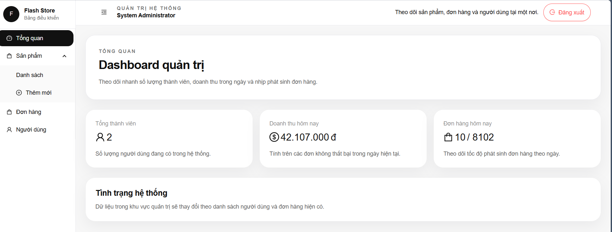

# Ecommerce Frontend

> Giao diện Next.js cho hệ ecommerce consumer dùng LSF, phục vụ demo checkout, realtime order status và màn hình bằng chứng quản trị.

Repository này là frontend của hệ thống backend consumer nằm ở `<workspace>/ecommerce-backend`. Giao diện không chỉ tạo đơn hàng như một storefront thông thường, mà còn giúp trình bày bằng chứng LSF: availability sau reservation, outbox events, Kafka DLQ, saga snapshot và các liên kết quan sát hệ thống.

## Đọc nhanh

| Mục tiêu đọc | Nên đọc |
|---|---|
| Hiểu frontend dùng để làm gì | [Dành cho ai?](#dành-cho-ai), [Chức năng chính](#chức-năng-chính), [Trang chính](#trang-chính) |
| Chạy source local | [Yêu cầu môi trường](#yêu-cầu-môi-trường), [Cài đặt và chạy local](#cài-đặt-và-chạy-local), [Scripts](#scripts) |
| Demo | [Luồng demo frontend đề xuất](#luồng-demo-frontend-đề-xuất), [Hình ảnh minh họa](#hình-ảnh-minh-họa), [Kiểm tra trước khi demo](#kiểm-tra-trước-khi-demo) |
| Phát triển hoặc debug | [Cấu trúc thư mục](#cấu-trúc-thư-mục), [Cách frontend gọi backend](#cách-frontend-gọi-backend), [Lỗi phổ biến khi chạy và cách sửa](#lỗi-phổ-biến-khi-chạy-và-cách-sửa) |

## Công nghệ sử dụng

| Nhóm | Công nghệ |
|---|---|
| Framework | Next.js 16, React 19 |
| Ngôn ngữ | TypeScript |
| UI | Ant Design 5, Tailwind CSS 4 |
| Data fetching | Axios, TanStack Query |
| State | Zustand |
| Realtime | SockJS, STOMP |
| Tooling | ESLint, npm |

## Chức năng chính

### Khách hàng

- Xem danh sách sản phẩm.
- Xem chi tiết sản phẩm, chọn màu/size/SKU.
- Đăng ký, đăng nhập và refresh token.
- Thêm/xóa sản phẩm trong giỏ hàng.
- Checkout và theo dõi trạng thái đơn hàng.
- Nhận cập nhật realtime qua WebSocket.
- Xem lịch sử đơn hàng và hồ sơ cá nhân.

### Admin

- Quản lý sản phẩm và biến thể.
- Xem danh sách đơn hàng.
- Xem và khóa/mở khóa người dùng.
- Mở màn `Framework Evidence` để đối chiếu trạng thái hoạt động của LSF:
  - inventory availability
  - order/saga timeline
  - recent outbox rows
  - Kafka DLQ topics/records
  - liên kết nhanh tới Grafana, Prometheus, Zipkin và phpMyAdmin

## Cấu trúc thư mục

```text
ecommerce-frontend/
├─ public/
├─ screenshots/
├─ src/
│  ├─ app/                 # App Router pages
│  ├─ components/          # UI components
│  ├─ components/admin/    # Admin và panel bằng chứng framework
│  ├─ constants/           # System links
│  ├─ lib/                 # axios client, auth helpers, normalizers
│  ├─ services/            # API clients
│  ├─ store/               # Zustand stores
│  └─ types/               # Shared TypeScript types
├─ .env.example
├─ next.config.ts
├─ package.json
└─ tsconfig.json
```

## Yêu cầu môi trường

- Node.js 20+
- npm 10+
- Backend đang chạy ở `<workspace>/ecommerce-backend`
- API entrypoint qua Nginx/Gateway tại `http://localhost:8000`
- WebSocket notification tại `http://localhost:8087/ws`

## Cài đặt và chạy local

### 1. Chạy backend trước

Khuyến nghị thứ tự:

```bash
cd <workspace>/lsf-parent
mvn clean install

cd <workspace>/ecommerce-backend
docker compose up -d
```

Sau đó chạy các Spring Boot services theo README backend.

### 2. Cài dependencies

```bash
cd <workspace>/ecommerce-frontend
npm install
```

### 3. Tạo file môi trường

```bash
copy .env.example .env.local
```

Nội dung mặc định:

```env
NEXT_PUBLIC_API_URL=http://localhost:8000
NEXT_PUBLIC_GATEWAY_URL=http://localhost:8000
NEXT_PUBLIC_PRODUCT_SERVICE_URL=http://localhost:8083
NEXT_PUBLIC_CART_SERVICE_URL=http://localhost:8084
NEXT_PUBLIC_ORDER_SERVICE_URL=http://localhost:8086
NEXT_PUBLIC_INVENTORY_SERVICE_URL=http://localhost:8082
NEXT_PUBLIC_WS_URL=http://localhost:8087/ws
NEXT_PUBLIC_GRAFANA_URL=http://localhost:3000
NEXT_PUBLIC_ZIPKIN_URL=http://localhost:9411
NEXT_PUBLIC_PROMETHEUS_URL=http://localhost:9090
NEXT_PUBLIC_PHPMYADMIN_URL=http://localhost:8888
NEXT_PUBLIC_GATEWAY_HEALTH_URL=http://localhost:8000/actuator/health
```

### 4. Chạy dev server

```bash
npm run dev
```

Frontend mặc định chạy tại:

```text
http://localhost:3001
```

## Scripts

| Lệnh | Mục đích |
|---|---|
| `npm run dev` | Chạy Next dev server ở port `3001` |
| `npm run build` | Build production |
| `npm run start` | Chạy production build |
| `npm run lint` | Chạy ESLint |

## Cách frontend gọi backend

`axiosClient` dùng `baseURL: "/"`. Next.js sẽ rewrite request trong `next.config.ts`:

| Frontend path | Backend đích |
|---|---|
| `/api/:path*` | `${NEXT_PUBLIC_API_URL}/api/:path*` |
| `/auth/:path*` | `${NEXT_PUBLIC_API_URL}/auth/:path*` |
| `/ops/gateway/:path*` | `${NEXT_PUBLIC_GATEWAY_URL}/:path*` |
| `/ops/product/:path*` | `${NEXT_PUBLIC_PRODUCT_SERVICE_URL}/:path*` |
| `/ops/cart/:path*` | `${NEXT_PUBLIC_CART_SERVICE_URL}/:path*` |
| `/ops/order/:path*` | `${NEXT_PUBLIC_ORDER_SERVICE_URL}/:path*` |
| `/ops/inventory/:path*` | `${NEXT_PUBLIC_INVENTORY_SERVICE_URL}/:path*` |

Access token được lưu trong `sessionStorage` và tự gắn vào header:

```text
Authorization: Bearer <access_token>
```

Khi gặp `401`, client sẽ thử refresh token qua `/auth/refresh`.

## Trang chính

| Route | Vai trò |
|---|---|
| `/` | Trang chủ/storefront |
| `/products` | Danh sách sản phẩm |
| `/product/[id]` | Chi tiết sản phẩm |
| Header/cart UI | Giỏ hàng qua Zustand store |
| `/checkout` | Checkout |
| `/checkout/waiting/[orderNumber]` | Màn hình chờ xử lý đơn hàng realtime |
| `/orders` | Đơn hàng của người dùng |
| `/login`, `/register` | Auth |
| `/profile` | Hồ sơ cá nhân |
| `/admin` | Dashboard admin |
| `/admin/products` | Quản lý sản phẩm |
| `/admin/orders` | Quản lý đơn hàng |
| `/admin/users` | Quản lý người dùng |
| `/admin/framework` | Evidence dashboard cho LSF |

## Luồng demo frontend đề xuất

1. Mở trang sản phẩm tại `/products` hoặc trang chủ storefront.
2. Chọn một sản phẩm và SKU còn hàng tại `/product/[id]`.
3. Thêm sản phẩm vào giỏ hàng và kiểm tra lại số lượng.
4. Checkout để tạo đơn hàng mới.
5. Theo dõi trạng thái tại `/checkout/waiting/[orderNumber]`, quan sát realtime update từ WebSocket.
6. Vào `/admin/framework` để kiểm tra bằng chứng vận hành: saga, reservation, outbox, Kafka DLQ và liên kết nhanh tới các công cụ quan sát hệ thống.

## Tài khoản demo

| Vai trò | Username | Password |
|---|---|---|
| Admin | `admin` | `admin123456@` |

User thường có thể đăng ký trực tiếp trên giao diện.

> Tài khoản demo chỉ dùng cho môi trường local và phục vụ bảo vệ luận văn. Không dùng lại cho production hoặc môi trường public.

## URL hệ thống liên quan

| Công cụ | URL |
|---|---|
| Frontend | `http://localhost:3001` |
| Backend API qua Nginx | `http://localhost:8000` |
| WebSocket | `http://localhost:8087/ws` |
| Keycloak | `http://localhost:8085` |
| Grafana | `http://localhost:3000` |
| Prometheus | `http://localhost:9090` |
| Zipkin | `http://localhost:9411` |
| phpMyAdmin | `http://localhost:8888` |

## Hình ảnh minh họa

Một số ảnh demo có trong thư mục `screenshots/`:



Trang danh sách sản phẩm giúp người xem bắt đầu flow mua hàng từ storefront.


Trang chi tiết sản phẩm thể hiện việc chọn màu/size/SKU và xem tồn kho khả dụng trước khi thêm vào giỏ hàng.



Giỏ hàng là bước trung gian trước checkout, giúp kiểm tra lại SKU và số lượng.


Màn checkout gửi yêu cầu tạo đơn hàng sang backend consumer và kích hoạt flow `cart -> order -> inventory -> payment -> notification`.


Màn hình chờ checkout hiển thị realtime order status, cho thấy reservation được confirm và event cuối đã được phát qua hệ thống.


Trang đơn hàng của tôi dùng để đối chiếu kết quả sau khi checkout hoàn tất.



Dashboard admin hỗ trợ kiểm tra nhanh dữ liệu quản trị như người dùng, doanh thu và số đơn phát sinh.


Màn hình Framework Evidence giúp người demo kiểm tra trạng thái hoạt động của LSF mà không cần đọc log thủ công, bao gồm availability, saga timeline, outbox, Kafka DLQ và các liên kết quan sát hệ thống.

## Lỗi phổ biến khi chạy và cách sửa

| Lỗi | Nguyên nhân thường gặp | Cách sửa |
|---|---|---|
| `npm install` lỗi do version Node | Node.js quá cũ so với Next.js 16/React 19 | Dùng Node.js 20+ rồi chạy lại `npm install` |
| `npm run dev` báo port `3001` đã được dùng | Dev server cũ đang chạy | Dừng process cũ hoặc đổi script `next dev -p 3001` trong `package.json` |
| Trang gọi API bị `404` hoặc `ECONNREFUSED` | Backend/Nginx ở `http://localhost:8000` chưa chạy hoặc `.env.local` sai | Chạy backend trước, kiểm tra `NEXT_PUBLIC_API_URL`, restart dev server |
| Đăng nhập bị `401` liên tục | Token cũ trong `sessionStorage` hết hạn hoặc refresh token lỗi | Logout, xóa `sessionStorage`, đăng nhập lại; kiểm tra `user-service` và Keycloak |
| Không thấy sản phẩm | `product-service` chưa chạy, MySQL chưa seed hoặc gateway route lỗi | Kiểm tra `product-service`, database `product-service`, và `http://localhost:8000/api/product` |
| Checkout không chuyển trạng thái | `order-service`, `inventory-service`, `payment-service` hoặc Kafka chưa sẵn sàng | Kiểm tra các service trong Eureka, Kafka/Schema Registry và log của từng service |
| Màn hình chờ không nhận realtime update | WebSocket URL sai hoặc `notification-service` chưa chạy | Kiểm tra `NEXT_PUBLIC_WS_URL=http://localhost:8087/ws`, chạy lại `notification-service` |
| Quick links Grafana/Zipkin/Prometheus/phpMyAdmin không mở được | Container quan sát chưa chạy hoặc port bị chiếm | Chạy `docker compose up -d` trong backend và kiểm tra các port tương ứng |
| Ảnh sản phẩm không hiển thị | URL ảnh bên ngoài bị chặn/mất mạng hoặc domain thay đổi | Kiểm tra network; `next.config.ts` hiện cho phép remote image HTTPS |

## Kiểm tra trước khi demo

- Backend services đã đăng ký đủ trên Eureka.
- Gateway/Nginx hoạt động và `http://localhost:8000` route được tới gateway.
- Keycloak realm đã import và admin user đã được seed.
- `notification-service` chạy để WebSocket cập nhật trạng thái đơn hàng.
- Grafana/Prometheus/Zipkin/phpMyAdmin chạy nếu muốn mở các liên kết nhanh phục vụ quan sát hệ thống.

## Trạng thái hoàn thành

| Phần | Trạng thái |
|---|---|
| Storefront cơ bản | Đã có |
| Auth/register/login/refresh | Đã có |
| Cart/checkout/order status | Đã có |
| WebSocket realtime | Đã có |
| Admin product/order/user | Đã có |
| Framework Evidence | Đã có để phục vụ demo LSF |
| Automated UI tests | Chưa có |
| Hoàn thiện theo chuẩn thương mại điện tử thực tế | Không phải mục tiêu chính |

## Lưu ý quan trọng

- Frontend phụ thuộc trực tiếp vào backend và các thành phần hạ tầng local; nếu API lỗi, kiểm tra backend trước.
- Nếu đổi port backend, cập nhật `.env.local` và restart `npm run dev`.
- Các liên kết nhanh chỉ hoạt động khi service tương ứng đang chạy.
- Đây là giao diện demo/luận văn, chưa phải website thương mại điện tử sẵn sàng cho môi trường production.

## Tác giả

- **Tên:** Nguyễn Lâm Trường
- **Email:** lamtruongnguyen2004@gmail.com
- **GitHub:** [https://github.com/truongnguyen3006](https://github.com/truongnguyen3006)
